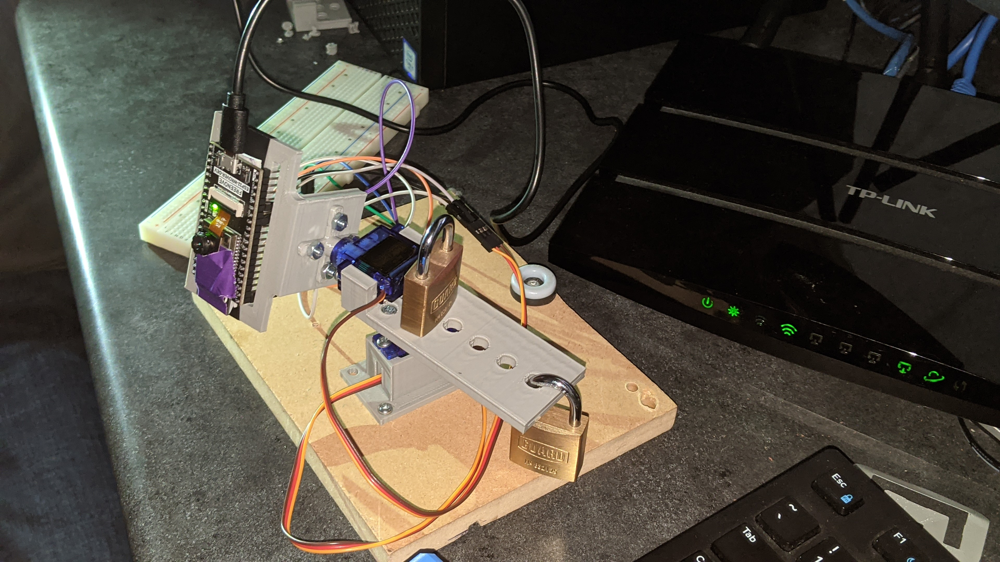
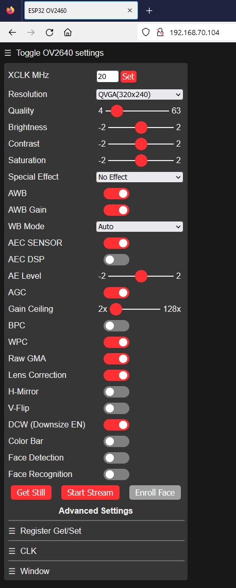
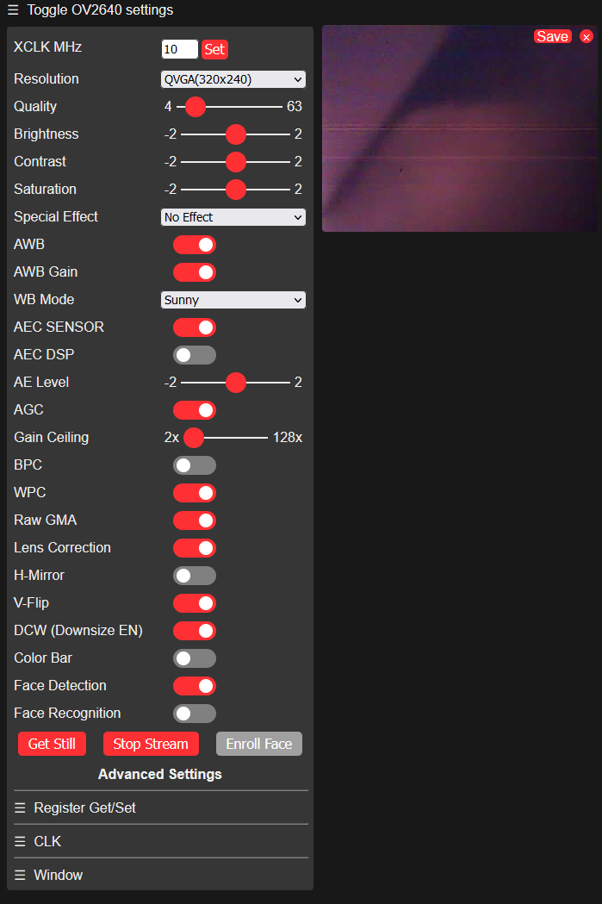

# Turret-Face-Tracker
The project was designed to track a persons face using an ESP32-Wrover and servos. Based on where the person's face is in the view of the camera, the device will move so as to center the person's face again.

Made for our TEJ Computer Technology class. Programmed using Arduino IDE and 3D models made in Autodesk Inventor.

## Instructions:
### Pins:
- Connect the signal pin of the PAN Servo to pin 12 of the ESP32
- Connect the signal pin of the TILT Servo to pin 13 of the ESP32
- Connect power of both servos to VCC of the ESP32
- Connect ground of both servos to GND of the ESP32

### Setup:
1. Follow [this](https://www.hackster.io/abdularbi17/how-to-install-esp32-board-in-arduino-ide-1cd571) link on how to setup ESP32 with arduino
2. Under Tools->Boards->ESP32 Arduino, select "ESP32 Wrover Module"
3. Under Tools->Partition Scheme, select "Huge APP (3MB No OTA/1MB SPIFFS)"
4. Change the WIFI SSID and Password if needed in the code, and make sure your computer is connected to the same WIFI through LAN or wireless
5. Upload the code to the right COM port
6. If nothing comes up in Serial Monitor, find IP address of ESP32 and go to that address in your browser
7. If all is good you will get a screen like this: 

8. Click "Start Stream", make XCLK Mhz = 10, switch on V-Flip, make Resolution = QVGA (320x240), make WB Mode = Sunny, and then switch on Face Detection

  

9. Sense your face and it should start tracking you

## Links:
### Tutorials:
- https://www.learnrobotics.org/blog/face-tracking-opencv/?utm_source=youtube&utm_medium=description&utm_campaign=face_tracking_video
- https://robotzero.one/face-tracking-esp32-cam/
- https://pastebinp.com/ECQPxuec
- https://randomnerdtutorials.com/esp32-cam-video-streaming-face-recognition-arduino-ide/
- https://how2electronics.com/esp32-cam-based-face-eyes-recognition-system/
- https://www.instructables.com/ESP32-CAM-Video-Streaming-Face-Recognition-Using-A/
- https://www.hackster.io/abdularbi17/how-to-install-esp32-board-in-arduino-ide-1cd571
- https://dronebotworkshop.com/esp32-servo/#:~:text=The%20ESP32%20has%20analog%20outputs,can%20drive%20several%20servo%20motors.

### Product and library links:
- https://github.com/madhephaestus/ESP32Servo/releases/tag/0.12.1
- ESP32: https://www.amazon.ca/Freenove-ESP32-WROVER-Bluetooth-Compatible-Tutorials/dp/B09BC5CNHM/ref=sr_1_5
  - With breakout board: https://www.amazon.ca/ESP32-WROVER-Contained-Compatible-Bluetooth-Tutorials/dp/B09BC1N9LL/ref=sr_1_6
